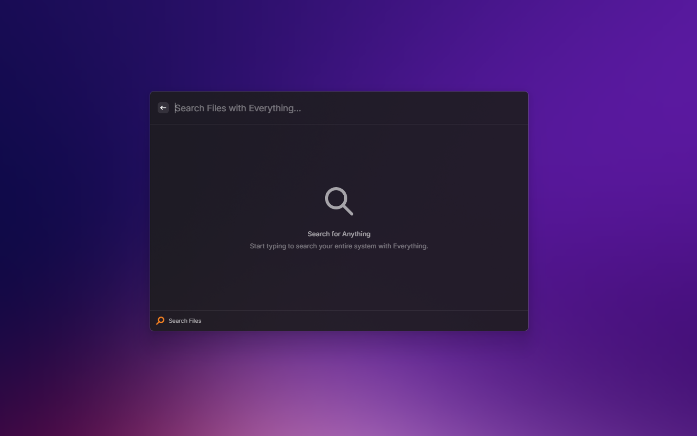

# Everything Extension for Raycast (Windows)




A powerful Raycast extension that integrates with Everything CLI to provide lightning-fast file system search and navigation on Windows. Transform your file discovery workflow with instant search results and comprehensive directory browsing capabilities.

> **Attribution**: Initially inspired by the [PuttTim/windows-terminal](https://github.com/PuttTim/windows-terminal) project structure & setup.

## 🚀 Features

### Lightning-Fast Search
- **Instant File Discovery**: Search your entire file system using Everything's powerful indexing engine
- **Real-time Results**: Get search results as you type with intelligent throttling
- **Configurable Search**: Set minimum character thresholds to optimize performance
- **Smart Filtering**: Supports all Everything CLI command-line arguments for advanced filtering

### Comprehensive Directory Navigation
- **Browse Directory Action**: Navigate into directories directly from search results
- **Recursive Exploration**: Browse through nested folder structures seamlessly
- **Smart File Detection**: Automatic distinction between files and directories
- **Native System Icons**: Uses Windows file icons for familiar visual experience

### Rich File Interactions
- **File Preview**: Instant preview of text files (supports 20+ file types including .txt, .md, .json, .js, .ts, .py, .sql, etc.)
- **Multiple Open Options**: Open files with default applications or show in Windows Explorer
- **Administrator Support**: Run executable files as administrator when needed
- **Custom File Explorer**: Configure custom file manager commands

### Flexible Actions & Shortcuts
- **Copy Operations**: Copy files, file names, or full paths to clipboard
- **Configurable Default Action**: Choose between opening files or showing folders as primary action
- **Keyboard Shortcuts**: Full keyboard navigation support
- **Context-Aware Actions**: Different actions available based on file type (file vs directory)

### Advanced Configuration
- **Custom Everything Path**: Specify custom es.exe location
- **Search Preferences**: Configure minimum characters before search triggers
- **File Explorer Integration**: Set custom file manager commands with placeholder support
- **Action Preferences**: Choose default behavior for file/folder interactions

## 📦 Installation

1. **Install Everything CLI**: Install the command-line interface for Everything
   ```bash
   winget install --id=voidtools.Everything.Cli -e
   ```

2. **Install Everything Desktop App**: Ensure Everything is installed and running (for indexing)
   - Download from [voidtools.com](https://www.voidtools.com/)
   - Or install via: 
   ```bash
   winget install voidtools.Everything
   ```

3. **Install Extension**: This extension is available through the Raycast store. Search for "Everything Search" in the Raycast store to install it.

## 🛠️ Configuration

Access the extension preferences in Raycast to customize:

- **Everything CLI Path**: Custom path to es.exe (leave empty to use system PATH)
- **File Explorer Command**: Custom file manager command (use `%s` as path placeholder)
- **Default Action**: Choose between opening files or folders as primary action
- **Default Sort**: Choose default sorting method for search results
- **Search Threshold**: Minimum characters required before search starts (default: 3)

## 💡 Usage Tips

- **Quick Search**: Start typing immediately - no need to wait for interface loading
- **Directory Navigation**: Use the "Browse Directory" action on folders to explore contents
- **File Preview**: Toggle detail view (`Ctrl+Shift+I`) to preview text files
- **Keyboard Shortcuts**: 
  - `Ctrl+C` / `Cmd+C`: Copy file name
  - `Ctrl+Shift+C` / `Cmd+Shift+C`: Copy full path
  - `Ctrl+Shift+.`: Copy file to clipboard
  - `Ctrl+Shift+I` / `Cmd+Shift+I`: Toggle details

## 🔧 Development

### Setting up Environment

If you want to contribute to this extension or run it locally:

1. **Node.js**: Install the latest version
   ```bash
   winget install -e --id OpenJS.NodeJS
   ```

2. **Clone and Setup**: Clone the repository and install dependencies
   ```bash
   git clone <repository-url>
   cd everything-raycast-extension
   npm install
   ```

### Available Scripts
- **Development**: `npm run dev` - Start development mode with hot reload
- **Build**: `npm run build` - Build extension for distribution
- **Lint**: `npm run lint` - Run ESLint and Prettier checks
- **Fix Linting**: `npm run fix-lint` - Automatically fix linting issues
- **Publish**: `npm run publish` - Publish extension to Raycast store

### Architecture Overview
- **Main Component**: `src/search-everything.tsx` - Primary React component handling search and navigation
- **Everything CLI Integration**: Uses Windows `es.exe` for file indexing and search
- **File Preview System**: Intelligent text file detection and preview for 20+ file types
- **Windows-Specific Features**: PowerShell integration for elevated permissions

## 📝 Notes

> **Author Note**: Native "Search Files" was not working on my machine, so I created this as a temporary workaround that evolved into a comprehensive file navigation solution.

The extension leverages Everything CLI's powerful search capabilities, so in theory, every `es.exe` command-line argument for filtering should work through the search interface.
